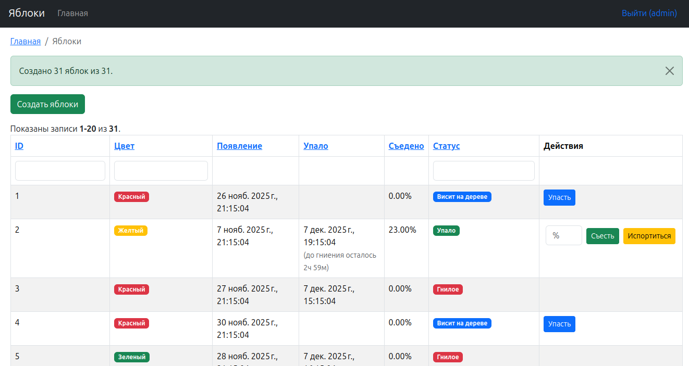

# Приложение Apple

## Установка и запуск

1. Добавьте в `/etc/hosts` домены `apple.loc` и `backend.apple.loc`

2. Скопируйте `.env.example` в .env и укажите там данные доступа к БД включая добавленные локальные домены

3. Запустите `docker compose up -d`

4. После успешного запуска контейнеров выполните `docker compose exec php init`

5. Настройте доступ к БД в соответствии с данными в .env в common/config/main-local.php

6. Выполните `docker compose exec php composer install`

7. Выполните `docker compose exec php yii migrate`

8. Создайте пользователя: `docker compose exec php yii user/create`

9. Теперь можно зайти в приложение `backend.apple.loc`

